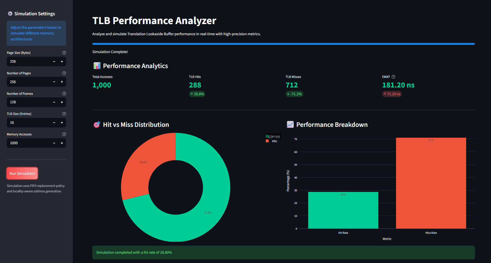

# 📂 TLB Performance Analyzer

Analyze and simulate the behavior of a **Translation Lookaside Buffer (TLB)** in modern memory management systems. This project calculates Effective Memory Access Time (EMAT) through hit/miss rate analysis across different simulation parameters.

---

## 📖 Project Overview
In computer architecture, a **Translation Lookaside Buffer (TLB)** is a memory cache that stores recent translations of virtual memory to physical memory. This project provides a comprehensive simulation environment to:
- Evaluate how TLB size and access patterns affect performance.
- Calculate **Effective Memory Access Time (EMAT)**.
- Visualize performance metrics through a dynamic web interface.

---

## 📸 Demo

*Modern Streamlit-based Web Interface for interactive analysis.*

---

## 🚀 Key Features
- **Deterministic Simulation**: Accurate tracking of TLB hits and misses.
- **Locality-aware Address Generation**: Simulates realistic memory access patterns using a locality-based generator.
- **Dynamic Analysis**: Adjust Page Size, TLB Size, and Number of Accesses in real-time.
- **EMAT Calculation**: Integrated performance metric engine.
- **Dual Mode**: Choose between a command-line interface (CLI) or a full-featured Streamlit Web UI.

---

## 🛠 How It Works
The simulation follows a standard memory translation logic:
1. **Virtual Address Generation**: A virtual address is generated (optionally with spatial locality).
2. **Page Number Extraction**: The system extracts the page number derived from the virtual address.
3. **TLB Lookup**: 
   - **Hit**: If the page is in the TLB, the physical frame is retrieved instantly.
   - **Miss**: If not in the TLB, the system looks up the **Page Table** and updates the TLB.
4. **FIFO Replacement**: If the TLB is full, the oldest entry is replaced (First-In, First-Out).
5. **EMAT Calculation**: Based on final Hit/Miss rates, the effective access time is computed.

---

## 🏗 Technical Architecture

### TLB Structure
- **Algorithm**: FIFO (First-In, First-Out).
- **Default Size**: 16 slots.
- **Logic**: Implemented in `simulator.py` using a list-based queue mechanism.

### Page Table Mapping
- A direct mapping project where virtual pages are mapped to physical frames based on a simulated memory footprint.

### Address Generation
- Uses a **locality-based approach** to better simulate real-world software behavior where consecutive memory accesses often fall within the same or nearby pages.

---

## 📊 Performance Metrics

### Key Assumptions
- **TLB Access Time**: 10 ns
- **Main Memory Access Time**: 100 ns
- **Replacement Policy**: FIFO

### EMAT Formula
The Effective Memory Access Time (EMAT) is calculated as:
```text
EMAT = (Hit_Rate * (TLB_Time + Memory_Time)) + ((1 - Hit_Rate) * (TLB_Time + 2 * Memory_Time))
```

---

## 💻 Sample Output (CLI)
Running `main.py` provides high-speed simulation results:
```text
===== PERFORMANCE =====
Total Accesses: 1000
TLB Hits: 320
TLB Misses: 680
Hit Rate: 0.32
Miss Rate: 0.68
EMAT: 178.00 ns
```

---

## ⚙️ Installation & Usage

### Prerequisites
- Python 3.8+
- [Streamlit](https://streamlit.io/)
- [Pandas](https://pandas.pydata.org/)

### Setup
```bash
# Install dependencies
pip install streamlit pandas
```

### Running CLI Version
```bash
python main.py
```

### Running Web UI (Streamlit)
```bash
streamlit run app.py
```

---

## 📂 Project Structure
- `simulator.py`: Core logic for `MemorySimulator` and address translation.
- `main.py`: Command-line script for quick performance snapshots.
- `app.py`: Streamlit application for interactive visualizations.
- `utils.py`: Helper functions for system-level operations.

---

## 🔮 Future Enhancements
- [ ] **LRU Replacement**: Implement Least Recently Used policy for comparison.
- [ ] **Comparative Graphs**: Track EMAT changes as TLB size grows.
- [ ] **Trace Support**: Support for real trace files (e.g., Valgrind output).

---

## 👨‍💻 Author
**Jagadeesh**
[GitHub Profile](https://github.com/jagadeesh-1431)

**Anjir Gautam**
[GitHub Profile](https://github.com/anjir-gautam)

**Tisha sinha**
[GitHub Profile](https://github.com/Tishasinha15)

